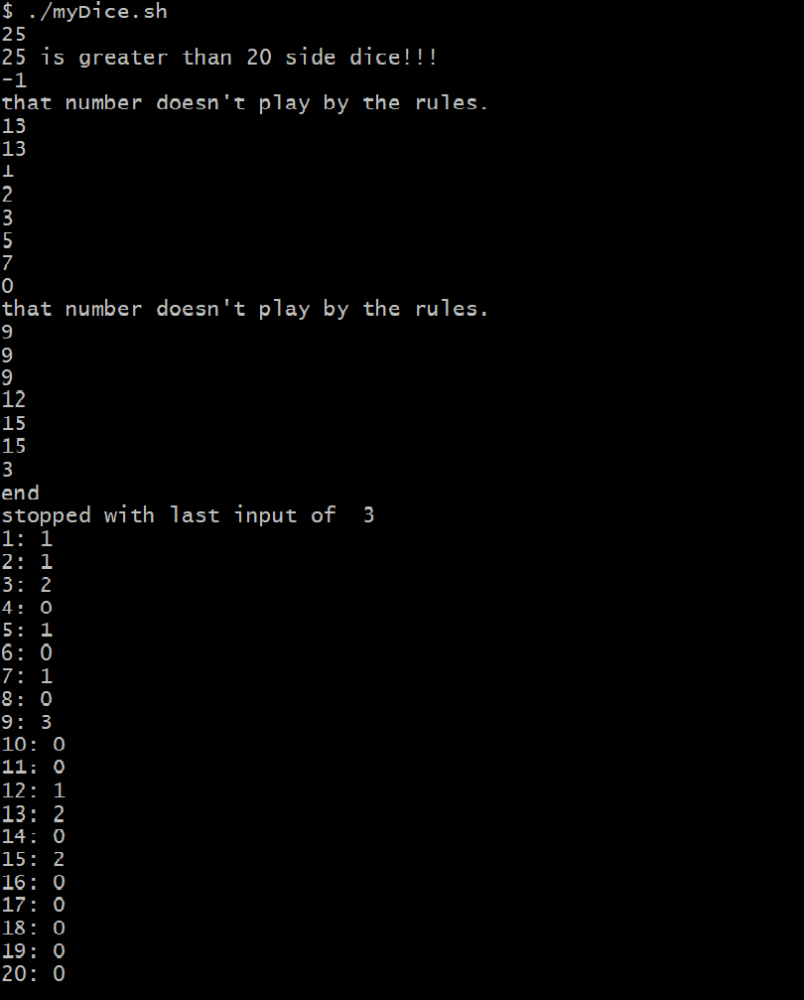

# SamD Project 0

**Dice Statistics - Python application**

A very simple Python application that takes Polyhadric dice information and gives 
the results of simple statistics. Used to see which dice yeild better results. 

It saves a profile for each set and can also give random sets. 

---

> [polyhedric dice](https://www.google.com/search?q=polyhedral+dice) come in many different shapes and sizes.
> Do they all produce the same rolls? 
> This Python application can be used to find out with your own dice the different characteristics. 
> 

---
- [Overview](#overview)
    - [Usage](#Usage)
- [Contact](#Contact)
---

## Overview

A very simple Python application that takes Polyhadric dice information and gives the results of simple statistics. Used to see which dice yeild better results. It saves a profile for each set and can also give random sets. 

## Usage

`Mydice` runs the program

MyDice [options]... Profile

## Contact
Sam Dare - samdr000@gmail.com

Project Link: https://github.com/2206-devops-batch/SamD
